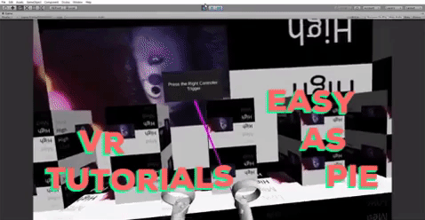

*VR Tutorial Maker* is an open-source, free Unity plugin created to help you quickly make controls tutorials for your VR game.
------
It has been tested in Unity Version 2018.4
-----
**Features:**
- Contains controller models for Rift S/Quest with highlightable buttons and joystick
- Includes a built-in haptic feedback system
- Includes "tutorial tip box" prefabs so you can point to buttons as you explain what they do in your amazing game!

**Planned Features:**
- Works on all platforms (Rift, Vive, Index, Go, ...)
- *Your work here*

